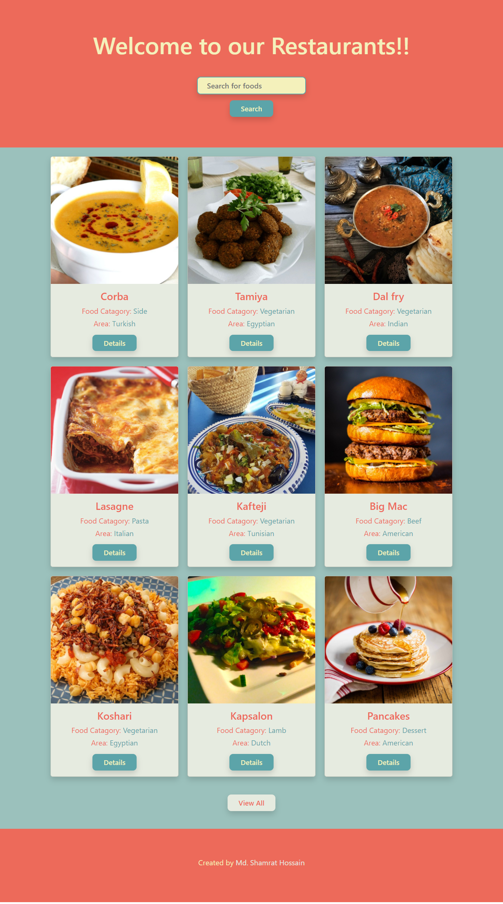

# Restaurants App

## Table of contents

- [Overview](#overview)
  - [Screenshot](#screenshot)
  - [Links](#links)
- [My process](#my-process)
  - [Built with](#built-with)
- [Author](#author)

## Overview

Purpose of this app is to learn the use of APIs.
Top Features:
1. Add a loading spinner
2. View All button
3. View Details button
4. Search bar
5. Drop Down search bar.

### Screenshot

### Links

- [Code URL](https://github.com/shamratPG/restaurants-app)
- [Live Site URL](https://shamratpg.github.io/restaurants-app/)

### Built with

- Semantic HTML5 markup
- Tailwind CSS
- Flexbox
- Vanilla JS
- Public API

## Author

- Website - [Md. Shamrat Hossain](https://github.com/shamratPG)
- Twitter - [@shamratpg](https://twitter.com/shamratpg)

